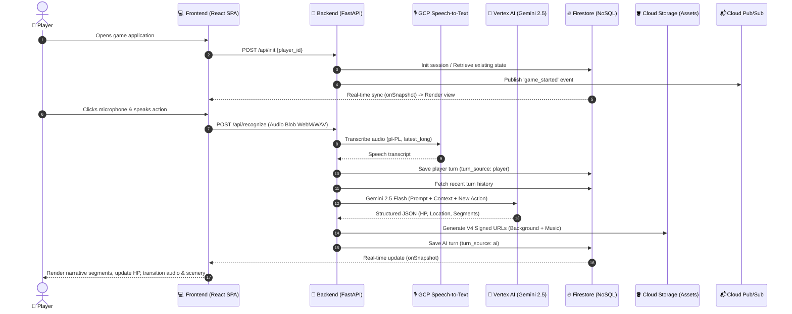

# 🎙️ Voice Fiction – AI-Powered Voice-Driven RPG Adventure

[](https://voice-fiction-app-293322474475.europe-central2.run.app/)
[](https://fastapi.tiangolo.com/)
[](https://react.dev/)
[](https://cloud.google.com/vertex-ai)
[](https://firebase.google.com/)

> **Voice Fiction** is an interactive, voice-controlled fantasy RPG adventure where your spoken words are the sole controller. Step into the boots of an adventurer, converse with characters, traverse treacherous woods, and duel the outlaw Rudan to retrieve a stolen silver family amulet.

🌐 **Production Live Demo:** [https://voice-fiction-app-293322474475.europe-central2.run.app/](https://voice-fiction-app-293322474475.europe-central2.run.app/)

---

## 📖 Table of Contents

- [About Voice Fiction](#-about-voice-fiction)
- [Key Features](#-key-features)
- [System Architecture](#-system-architecture)
- [Tech Stack](#-tech-stack)
- [Prerequisites](#-prerequisites)
- [Local Development Setup](#-local-development-setup)
  - [1. Clone Repository](#1-clone-repository)
  - [2. Google Cloud Platform (GCP) Configuration](#2-google-cloud-platform-gcp-configuration)
  - [3. Backend Setup (FastAPI)](#3-backend-setup-fastapi)
  - [4. Frontend Setup (React + Vite)](#4-frontend-setup-react--vite)
  - [5. Running with Docker](#5-running-with-docker)
- [Environment Variables](#-environment-variables)
- [API Endpoints](#-api-endpoints)
- [Project Structure](#-project-structure)
- [Production Deployment (Google Cloud Run)](#-production-deployment-google-cloud-run)
- [License & Acknowledgments](#-license--acknowledgments)

---

## ⚔️ About Voice Fiction

In **Voice Fiction**, the player embarks on a structured 3-act narrative with a sword and shield in hand:
1. **Act 1: The Dead Boar Tavern** – Meet the innkeeper who asks you to recover a stolen silver heirloom amulet taken by the bandit Rudan.
2. **Act 2: The Dark Forest Crossroads** – Reach a branching trail (left or right path). Each choice presents unique environmental descriptions and challenges leading toward the villain's hideout.
3. **Act 3: The Duel with Rudan** – A tactical combat encounter where your decisions and reflexes decide the outcome. Victory is attained upon subduing Rudan and reclaiming the amulet, while the game ends in defeat if your HP reaches 0.

Every voice command is recorded in the browser, transcribed with high accuracy, and processed by **Gemini 2.5 Flash** (via Google Cloud Vertex AI) acting as a dynamic and immersive Game Master.

---

## ✨ Key Features

- 🎤 **Voice-First Interaction** – Audio captured directly in the browser via Web Audio & MediaRecorder APIs (single-channel mono, noise suppression, acoustic echo cancellation, supporting WebM/Ogg/WAV).
- 🗣️ **Automated Speech Recognition (STT)** – Powered by Google Cloud Speech-to-Text (`latest_long` model with bilingual support for English `en-US` and Polish `pl-PL`, automatic punctuation).
- 🧠 **AI Game Master (Gemini 2.5 Flash)** – Responsive storytelling adapting to the player's language (English or Polish) with strict structured JSON outputs (`Structured Outputs`) ensuring consistent state management, dialogue/narration segmentation, and HP tracking.
- ⚡ **Real-Time State Synchronization** – Google Cloud Firestore listeners (`onSnapshot`) ensure seamless real-time UI updates without polling overhead.
- 🌐 **Bilingual UI & Voice Support** – Instant language switching between English and Polish in settings with persistent preferences and localized gameplay.
- 🎵 **Adaptive Dynamic Audio & Backgrounds** – Ambient music tracks and scene backdrops loaded securely from Google Cloud Storage via V4 Signed URLs with smoothstep volume fading during voice recording.
- 📡 **Event-Driven Pub/Sub** – Asynchronous event dispatching (e.g. `game_started` event) to Google Cloud Pub/Sub (`game-events`).
- 🔄 **Persistent Player Sessions & Reset** – Unique `player_id` generation in `localStorage`, full session history persistence, and instantaneous session reset capabilities.

---

## 🏗️ System Architecture



---

## 🛠️ Tech Stack

### Frontend
- **Framework:** [React 19](https://react.dev/) + [TypeScript](https://www.typescriptlang.org/)
- **Build Tool:** [Vite 8](https://vitejs.dev/)
- **Real-Time Client:** [Firebase JS SDK](https://firebase.google.com/docs/web/setup) (`firestore` real-time listeners)
- **Audio Capture:** Web Audio API, MediaRecorder API
- **Container Server:** Nginx Alpine (Reverse proxy & SPA routing)

### Backend
- **Framework & Runtime:** [Python 3.11](https://www.python.org/) + [FastAPI](https://fastapi.tiangolo.com/) + [Uvicorn](https://www.uvicorn.org/)
- **Generative AI:** Google Cloud Vertex AI SDK (`gemini-2.5-flash`)
- **Speech-to-Text:** Google Cloud Speech API (`google-cloud-speech`)
- **Database:** Google Cloud Firestore (`google-cloud-firestore`)
- **Storage:** Google Cloud Storage (`google-cloud-storage`) – V4 Signed URL generation
- **Messaging:** Google Cloud Pub/Sub (`google-cloud-pubsub`)

### Infrastructure & Cloud (GCP)
- **Container Hosting:** [Google Cloud Run](https://cloud.google.com/run) (Region: `europe-central2` – Warsaw)
- **Containerization:** Docker (Multi-stage build for frontend, lightweight Python-slim for backend)
- **IAM & Security:** Application Default Credentials (ADC) & Service Accounts with fine-grained roles.

---

## 📋 Prerequisites

Ensure the following tools are installed on your machine before local setup:
- **Node.js** (`>= 20.x`) and **npm**
- **Python** (`3.11` or newer)
- **Docker** *(optional, for containerized execution)*
- **Google Cloud SDK (`gcloud` CLI)** and an active GCP Project with the following APIs enabled:
  - *Cloud Speech-to-Text API*
  - *Vertex AI API*
  - *Cloud Firestore API*
  - *Cloud Storage API*
  - *Cloud Pub/Sub API*
  - *IAM Credentials API*

---

## 🚀 Local Development Setup

### 1. Clone Repository

```bash
git clone https://github.com/your-username/voice_fiction.git
cd voice_fiction
```

---

### 2. Google Cloud Platform (GCP) Configuration

The backend requires credentials to access Google Cloud services. You can configure authentication via either method:

#### Option A (Recommended for Local Dev): Service Account JSON Key
1. Generate a Service Account JSON key in Google Cloud Console.
2. Save the file at `backend/gcp-credentials.json` (ignored by git).
3. Alternatively, export the environment variable:
   ```bash
   export GOOGLE_APPLICATION_CREDENTIALS="/absolute/path/to/your-key.json"
   ```

#### Option B: Application Default Credentials (ADC)
```bash
gcloud auth application-default login
gcloud config set project YOUR_PROJECT_ID
```

---

### 3. Backend Setup (FastAPI)

1. Navigate to the `backend` directory:
   ```bash
   cd backend
   ```

2. Create and activate a Python virtual environment:
   ```bash
   python3 -m venv .venv
   source .venv/bin/activate  # On Windows: .venv\Scripts\activate
   ```

3. Install required Python packages:
   ```bash
   pip install -r requirements.txt
   ```

4. Start the FastAPI development server:
   ```bash
   uvicorn main:app --reload --port 8080 --host 0.0.0.0
   ```

- Backend API: `http://localhost:8080`
- Interactive Swagger Docs: `http://localhost:8080/docs`
- Health check: `http://localhost:8080/api/health`

---

### 4. Frontend Setup (React + Vite)

1. Open a new terminal and navigate to the `frontend` directory:
   ```bash
   cd frontend
   ```

2. Create your local environment file `.env.local` based on `.env.example`:
   ```env
   # Backend URL (local development)
   VITE_BACKEND_URL=http://localhost:8080

   # Firebase Configuration (From Firebase Console -> Project Settings -> General -> Web App)
   VITE_FIREBASE_API_KEY=your_api_key
   VITE_FIREBASE_AUTH_DOMAIN=your_project_id.firebaseapp.com
   VITE_FIREBASE_PROJECT_ID=your_project_id
   VITE_FIREBASE_STORAGE_BUCKET=your_project_id.firebasestorage.app
   VITE_FIREBASE_MESSAGING_SENDER_ID=your_messaging_sender_id
   VITE_FIREBASE_APP_ID=your_app_id
   VITE_MEASUREMENT_ID=your_measurement_id
   ```

3. Install Node.js dependencies:
   ```bash
   npm install
   ```

4. Start the Vite development server:
   ```bash
   npm run dev
   ```

Open `http://localhost:5173` in your browser. Be sure to **grant microphone access permissions** when prompted!

---

### 5. Running with Docker

Both frontend and backend are equipped with production-grade Dockerfiles.

#### Build and Run Backend:
```bash
cd backend
docker build -t voice-fiction-backend .
docker run -p 8080:8080 \
  -e GOOGLE_APPLICATION_CREDENTIALS="/app/gcp-credentials.json" \
  -v $(pwd)/gcp-credentials.json:/app/gcp-credentials.json:ro \
  voice-fiction-backend
```

#### Build and Run Frontend (Nginx):
```bash
cd frontend
docker build -t voice-fiction-frontend .
docker run -p 8080:8080 voice-fiction-frontend
```

---

## ⚙️ Environment Variables

### Backend Configuration

| Variable | Default Value | Description |
| :--- | :--- | :--- |
| `PORT` | `8080` | Server listening port |
| `GOOGLE_APPLICATION_CREDENTIALS` | `backend/gcp-credentials.json` | Path to GCP Service Account JSON credentials |
| `VITE_FIREBASE_PROJECT_ID` | Auto-detected / `your-gcp-project-id` | Google Cloud / Firebase Project ID |
| `GOOGLE_CLOUD_REGION` | `us-central1` | GCP region for Vertex AI models |
| `GCS_BUCKET_NAME` | `your-gcs-bucket-name` | GCS Bucket storing audio tracks and scenery backgrounds |
| `CORS_ORIGINS` | `localhost:5173, Cloud Run URL` | Comma-separated list of allowed CORS origins |
| `MAX_AUDIO_BYTES` | `358400` (~350 KB) | Audio file upload limit (~6–8 seconds of speech) |

### Frontend Configuration (`frontend/.env.local` / `.env.production`)

| Variable | Description |
| :--- | :--- |
| `VITE_BACKEND_URL` | Backend URL (empty for same-origin relative paths, or `http://localhost:8080`) |
| `VITE_FIREBASE_API_KEY` | Firebase Web App API Key |
| `VITE_FIREBASE_AUTH_DOMAIN` | Firebase Authentication Domain |
| `VITE_FIREBASE_PROJECT_ID` | Firebase / GCP Project Identifier |
| `VITE_FIREBASE_STORAGE_BUCKET` | Default Firebase Storage bucket |
| `VITE_FIREBASE_MESSAGING_SENDER_ID` | Firebase Cloud Messaging Sender ID |
| `VITE_FIREBASE_APP_ID` | Firebase Web App Identifier |

---

## 📡 API Endpoints

### `GET /api/health`
Health check endpoint used by Cloud Run probes.
- **Response:** `{"status": "ok"}`

### `POST /api/init`
Initializes a new game session or retrieves an existing one, publishing a `game_started` event to Pub/Sub.
- **Request Body:**
  ```json
  {
    "player_id": "player_abc123"
  }
  ```
- **Response:** Current game turn object with fresh signed asset URLs.

### `POST /api/recognize`
Accepts recorded audio (`multipart/form-data`), transcribes speech via Google STT, prompts Gemini 2.5 Flash for the next game turn, and persists updates to Firestore.
- **Form Data:**
  - `player_id` (`string`): Unique player ID.
  - `audio` (`file`): Audio blob (`audio/webm`, `audio/ogg`, `audio/wav`).
- **Response:**
  ```json
  {
    "player_id": "player_abc123",
    "transcript": "I look around the tavern and ask the innkeeper about the bandit."
  }
  ```

### `POST /api/reset`
Deletes all existing player turns in a batch Firestore operation and resets the session to Act 1 (Tavern, 100 HP).
- **Request Body:** `{"player_id": "player_abc123"}`

---

## 📁 Project Structure

```text
voice_fiction/
├── README.md                      # Project documentation (English)
├── .gitignore                     # Git ignore rules
├── backend/                       # Python FastAPI Backend
│   ├── api.py                     # Route handlers (/init, /recognize, /reset, /health)
│   ├── ai_engine.py               # Vertex AI (Gemini 2.5 Flash) prompt and structured outputs
│   ├── firestore_client.py        # Firestore operations, turn management & Signed URLs
│   ├── storage_client.py          # Google Cloud Storage integration & V4 URL signing
│   ├── pubsub_client.py           # Pub/Sub client for game lifecycle events
│   ├── main.py                    # Application entrypoint & CORS middleware
│   ├── requirements.txt           # Python package dependencies
│   ├── Dockerfile                 # Backend container definition
│   └── test_fastapi.py            # Automated tests
├── frontend/                      # React + TypeScript Frontend
│   ├── src/
│   │   ├── App.tsx                # Main game UI, Firestore listener & audio fader
│   │   ├── App.css                # Dark fantasy styling and responsive layout
│   │   ├── useVoiceRecorder.ts    # Web Audio & MediaRecorder custom hook
│   │   ├── firebase.ts            # Firebase Client SDK initialization
│   │   ├── main.tsx               # React application root
│   │   └── index.css              # Global styles and typography
│   ├── public/                    # Static assets (avatars, logo, default icons)
│   ├── nginx.conf                 # Nginx configuration for SPA routing
│   ├── Dockerfile                 # Multi-stage production container build
│   ├── package.json               # Frontend dependencies & scripts
│   ├── tsconfig.json              # TypeScript configuration
│   └── vite.config.ts             # Vite bundler configuration
```

---

## ☁️ Production Deployment (Google Cloud Run)

Both microservices are deployed as serverless containers on **Google Cloud Run**:

```bash
# 1. Deploy Backend API
cd backend
gcloud run deploy voice-fiction \
  --source . \
  --region europe-central2 \
  --platform managed \
  --allow-unauthenticated \
  --set-env-vars GCS_BUCKET_NAME=your_gcs_bucket_name

# 2. Deploy Frontend SPA
cd ../frontend
gcloud run deploy voice-fiction-app \
  --source . \
  --region europe-central2 \
  --platform managed \
  --allow-unauthenticated
```

---

## 📄 License & Acknowledgments

Created for demonstration and educational purposes, highlighting the integration of **Generative AI (Gemini 2.5 Flash)**, **Speech-to-Text**, and **Google Cloud Serverless Architecture** in real-time interactive voice applications.

🎮 **Play Live:** [https://voice-fiction-app-293322474475.europe-central2.run.app/](https://voice-fiction-app-293322474475.europe-central2.run.app/)